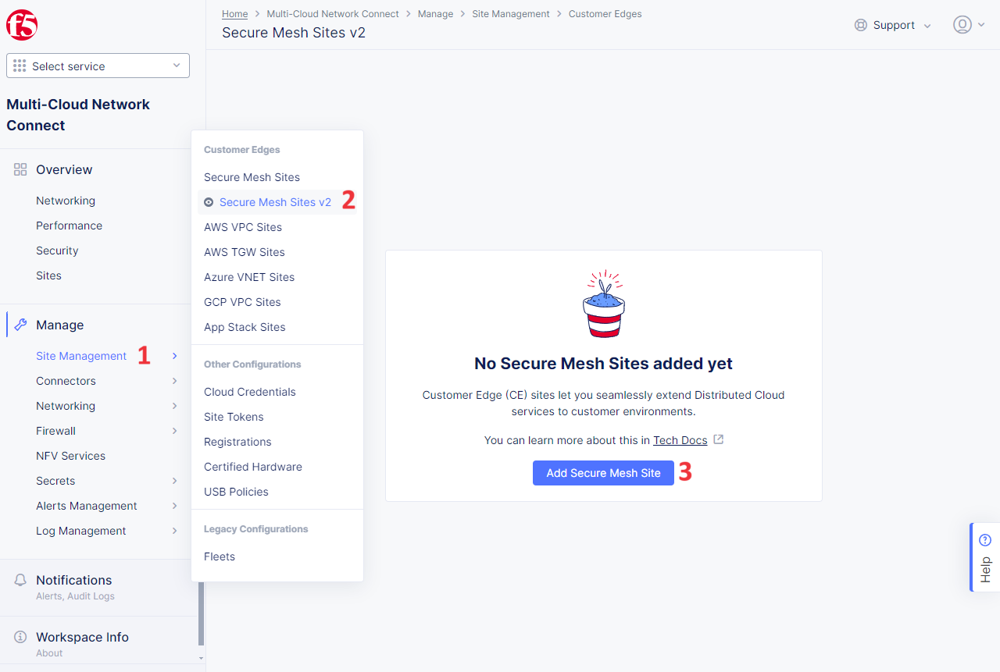
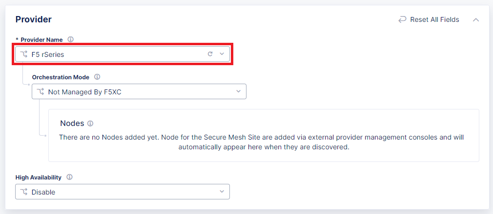
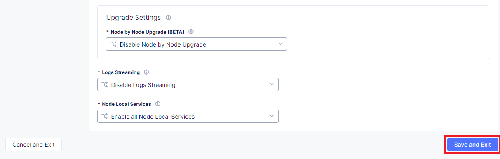
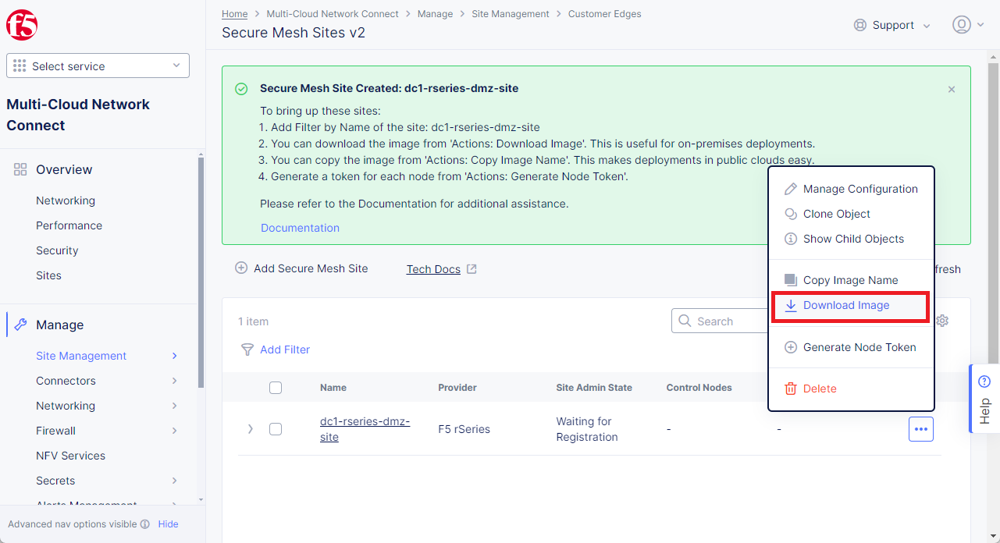
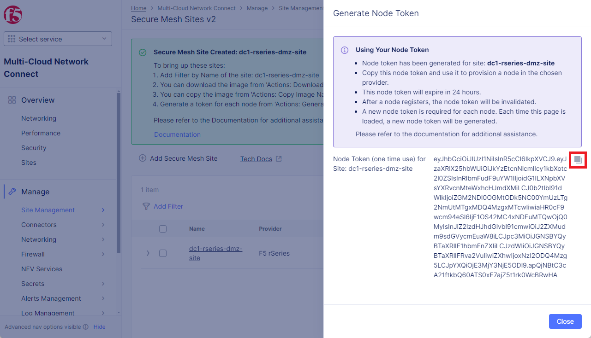
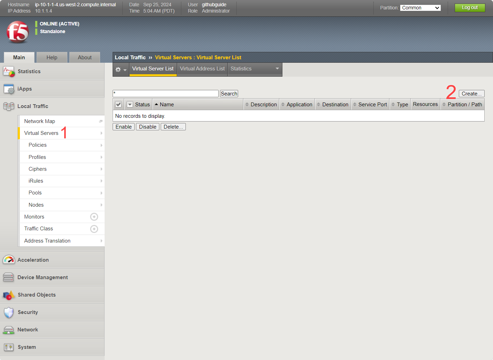
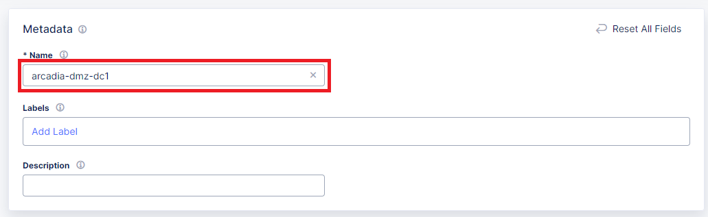
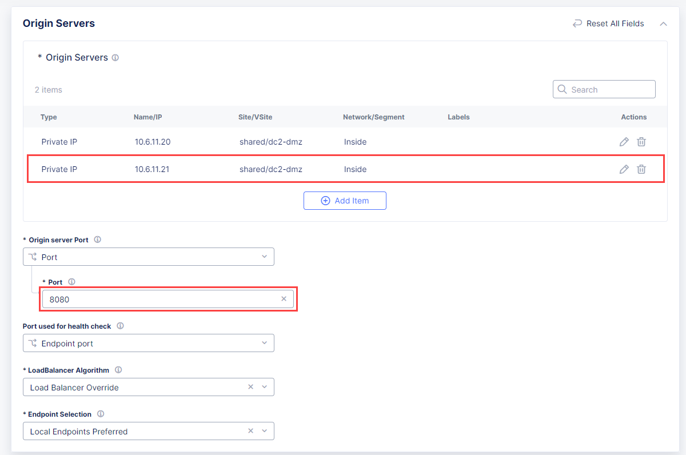

# F5 rSeries DMZ Setup

# Table of Contents

- [F5 rSeries DMZ Setup](#f5-rseries-dmz-setup)
- [Table of Contents](#table-of-contents)
- [Overview](#overview)
- [Setup Diagram](#setup-diagram)
- [1. Configure Environment](#1-configure-environment)
  - [1.1 Prerequisites](#11-prerequisites)
  - [1.2 Deploy CE Tenant on F5 rSeries](#12-deploy-ce-tenant-on-f5-rseries)
  - [1.2.1 Create Secure Mesh Site in XC Cloud](#121-create-secure-mesh-site-in-xc-cloud)
  - [1.2.2 Deploy CE Tenant on F5 rSeries](#122-deploy-ce-tenant-on-f5-rseries)
  - [1.3 Deploy and Confgiure Big-IP on F5 rSeries](#13-deploy-and-confgiure-big-ip-on-f5-rseries)
  - [1.3.1 Deploy Big-IP on F5 rSeries](#131-deploy-big-ip-on-f5-rseries)
  - [1.3.2 Configure Big-IP on F5 rSeries](#132-configure-big-ip-on-f5-rseries)
  - [1.5 Configure Application VMs](#15-configure-application-vms)
- [2. Expose Application to the Internet](#2-expose-application-to-the-internet)
  - [2.1 Create Big-IP Virtual Server](#21-create-big-ip-virtual-server)
  - [2.2 Configure XC Virtual Site](#22-configure-xc-virtual-site)
  - [2.3 Create HTTP Load Balancer](#23-create-http-load-balancer)
- [3. Protect Application](#3-protect-application)
  - [3.1 Configure WAF](#31-configure-waf)
  - [3.2 Configure Bot Protection](#32-configure-bot-protection)
  - [3.3 Configure API Discovery](#33-configure-api-discovery)
  - [3.4 Configure DDoS Protection](#34-configure-ddos-protection)
  - [3.5 Configure Malicious User and IP Reputation](#35-configure-malicious-user-and-ip-reputation)
  - [3.6 Verify Application](#36-verify-application)
  - [4.3 Setup DMZ Configuration](#43-setup-dmz-configuration)

# Overview

# Setup Diagram


# 1. Configure Environment

## 1.1 Prerequisites

The following components are required to complete the setup:

- Access to the [XC Cloud](https://cloud.f5.com) with the following services enabled:
  - ability to create Sites
  - Bot Protect
  - DDoS Protect
  - Api Protect
  - Api Discovery
- F5 rSeries: 5600 / 5800 / 5900/ 10600 / 10800 / 10900 / 12600 / 12800 / 12900
- Ubuntu VM with access to the F5 rSeries interface
<!-- - VMware environment with XC Site installed and Ubuntu VM deployed -->
- Domain Name

## 1.2 Deploy CE Tenant on F5 rSeries

In this section, we will create a Secure Mesh Site in the XC Cloud. We will provide only the basic information required to create the site. The detailed information can be found here: [Deploy Secure Mesh Site v2 on F5 BIG-IP rSeries Appliance (ClickOps)](https://docs.cloud.f5.com/docs-v2/multi-cloud-network-connect/how-to/site-management/deploy-sms-rseries#procedure).

## 1.2.1 Create Secure Mesh Site in XC Cloud

Open XC Cloud and navigate to the `Multi-Cloud Network Connect`. In the left navigation pane, click on `Site Management` and then click on `Secure Mesh Sites v2`. In the `Secure Mesh Sites v2` page, click on the `Add Secure Mesh Site` button.



Fill the name of the site and assign custom label `dc == dc1-dmz`.


Select the provider as `F5 rSeries`. Leave other fields as default.



Click on the `Save and Exit` button to apply the changes.



Open action menu of the created site and click on `Download Image`. Save the image to your local machine, you will need it later.



Open action menu again and click on `Generate Node Token`.


From the `Generate Node Token` dialog, copy the token.



## 1.2.2 Deploy CE Tenant on F5 rSeries

Sign in to the F5 rSeries interface and navigate to the `TENANT MANAGEMENT` tab. Click on the `Tenant Images`. Then click on the `Upload` button.


Select the image you downloaded in the previous step and click `Open`.


Navigate to `Tenant Deployments` and click on the `Add` button.


Fill in the required fields:

- `Name`: dc1-dmz
- `Type`: Generic
- `Image`: select the image you uploaded
- `IP Address`: IP address of the SLO interface
- `Gateway`: Gateway IP address
- `VLANs`: check the `SLO` and `SLI` VLANs
- `vCPUs`: 4
- `Virtual Disk Size`: 50 GB
- `Metadata`: paste the token you copied in the previous step and VLAN ID in the following format: `[primary-vlan:SLO token:your_token_from_xc_cloud]`

Click on the `Save & Close` button to apply the changes.


Go back to the XC Cloud and navigate to the `Sites`. Wait until the site is deployed and provisioned.


## 1.3 Deploy and Confgiure Big-IP on F5 rSeries

## 1.3.1 Deploy Big-IP on F5 rSeries

In the F5 rSeries interface navigate to `Tenant Images` and click on the `Upload` button.


Select the Big-IP image and click `Open`.


Navigate to `Tenant Deployments` and click on the `Add` button.


Fill in the required fields:

- `Name`: big-ip-tmos
- `Type`: BIG-IP
- `Image`: select the image you uploaded
- `IP Address`: 10.192.76.26
- `Gateway`: Gateway IP address
- `VLANs`: check the `SLI` and `BIG-IP` VLANs
- `vCPUs`: 4
- `Virtual Disk Size`: 82 GB
- `State`: Deployed

Click on the `Save & Close` button to apply the changes.


## 1.3.2 Configure Big-IP on F5 rSeries

Log in your BIG-IP TMOS instance and navigate to `Network`. Select `VLANs` and click the `Create` button.


In the opened form fill in the VLAN name, tag and interface. Click `Finished` as soon as the fields are filled out.


Next, proceed to `Self IPs` and click `Create`.


This will open the configuration form. Fill in the following fields:

- `Name`: 10.5.11.20
- `IP Address`: 10.5.11.20
- `Netmask`: 255.255.255.0
- `VLAN / Tunnel`: select the VLAN you create in the previous step

Click `Finished` as soon as the fields are filled out.


## 1.5 Configure Application VMs

The main application is a simple web application that simulates a banking application. The application is hosted on an Ubuntu VM. The following steps are required to configure the main application VM:

- SSH into the VM
- Install [docker and docker-compose](https://docs.docker.com/engine/install/ubuntu/)
- Clone the repository
- Open `./application/main/` folder
- Run `docker compose up -d`

Optionally update the environment variables in the `docker-compose.yml` file.

Verify that the application is running by accessing `http://{{your_vm_ip}}:8080` in the browser or using curl command.


# 2. Expose Application to the Internet

## 2.1 Create Big-IP Virtual Server

In this section, we will configure the Big-IP Virtual Server to expose the application to the XC SLI network. We will create a pool with the application VM as a member and then create a Virtual Server to route the traffic to the pool.

Open the Big-IP interface and navigate to the `Local Traffic` tab. Click on the `Pools` and then click on the `Create` button.


Fill in the required fields:

- `Name`: application-pool
- `Health Monitors`: select `http`
- `Node Name`: give a name to the node
- `Address`: IP address of the application VM
- `Service Port`: 8080

Click on the `Add` button to add the node to the pool and then click on the `Finished` button to create the pool.


In the `Local Traffic` tab click on the `Virtual Servers`. Then click on the `Create` button.



Fill in the required fields:

- `Name`: arcadia-application
- `Destination Address`: select the `SLI` network IP address
- `Service Port`: 8080
- Set `HTTP Profile (Client)` to `http`


- Set `Source Address Translation` to `Auto Map`


- Set `Default Pool` to `application-pool` and click on the `Finished` button to create the Virtual Server.


The application is now exposed to the XC SLI network. You can try to access the application using the IP address of the SLI network.

## 2.2 Configure XC Virtual Site

In order to expose our application with two Secure Mesh Sites for failover to the internet, we need to combine them using Virtual Site and then add an HTTP Load Balancer. You can see the setup in the diagram below.

> > > > TODO: add diagramm


Let's start with adding a virtual site. Back in the F5 Distributed Cloud Console, navigate to the **Shared Configuration** service. From there, select **Virtual Sites** and click the **Add Virtual Site** button.


In the opened form give virtual site a name that we specified as [label](#12-create-secure-mesh-site-in-xc-cloud) for Secure Mesh Sites. Then make sure to select the **CE** site type. After that add selector expression specifying its name as value and complete by clicking the **Save and Exit** button.


## 2.3 Create HTTP Load Balancer

Next, we will configure HTTP Load Balancer to expose the created Virtual Site connecting two Secure Mesh Sites to the Internet.


Proceed to the **Multi-Cloud App Connect** service => **Load Balancers** => **HTTP Load Balancers**. Click the **Add HTTP Load Balancer** button.


First, give HTTP Load Balancer a name.


Then we will configure **Domains and LB Type** section. Type in the **arcadia-dmz.f5-cloud-demo.com** domain and select **HTTPS with Automatic Certificate** as Load Balancer Type. Make sure to enable HTTP redirect to HTTPS and add HSTS header.


Scroll down to the **Origins** section and add an origin pool by clicking the **Add Item** button.


Open the **Origin Pool** drop-down menu and click **Add Item** to add an origin pool.


Give origin pool a name.



Then click **Add Item** to add an origin server.


Select **IP address of Origin Server on given Sites** as Origin Server type and type in the **10.5.11.20** private IP (your BigIP XC interface). Then in the drop-down menu select the [Virtual Site](#21-configure-virtual-site) we created earlier. Complete the configuration by clicking the **Apply** button.


Type in the **8080** origin server port.


Scroll down to the **Health Checks** section and click the **Add Item** button to add a health check.


Give health check a name and leave the default settings. Then click **Continue** to save the health check configuration.


Scroll down and click **Continue**.


**Apply** origin pool configuration.


Now that the HTTP Load Balancer is configured, click **Save and Exit** to save it.


# 3. Protect Application

Now that we have exposed the Virtual Site with two Secure Mesh Sites to the Internet using an HTTP Load Balancer, we will configure protection for the deployed application: WAF, Bot Protect, API Discovery, DDoS Protection, and Malicious User and IP Reputation.


To do that go back to the F5 Distributed Cloud Console and select **Manage Configuration** in the service menu of the created HTTP Load Balancer.


Click the **Edit Configuration** button to enable the editing mode.


## 3.1 Configure WAF

First, let's configure WAF protection. Scroll down to the **Web Application Firewall** section and enable WAF. Open the dropdown menu and click **Add Item**.


Give WAF a name and move on to **Enforcement Mode** configuration.


Select **Blocking** mode in the drop-down menu to log and block threats.


Proceed to **Detection Settings**. Select **Custom** Security Policy and take a look at its settings. Then scroll down to the **Signature-Based Bot Protection** and select **Custom**.


Finally, let's configure **Blocking Response Page** in **Advanced configuration**. Select **Custom** and configure as needed. Click **Continue** to complete WAF configuration and go back to the HTTP configuration page.


## 3.2 Configure Bot Protection

Next, we will configure Bot Protection. Scroll to the **Bot Protection** section and select **Enable Bot Defense Standard** in the drop-down menu. Move on by clicking **Configure**.


Proceed to configure Protected App Endpoint.


Click the **Add Item** button which will open the creation form.


Let's configure the endpoint. First, give it a name. Then select HTTP methods and choose specifying endpoint label category. Specify **Authentication** as flow label category and select **Login** for flow label. Move on and specify path prefix - **/trading/auth**. Select **Block** for the Bot Mitigation action and save the configuration by clicking **Apply**.


Take a look at the created App Endpoint and apply its configuration.


You will see Bot Defense Policy settings. Click the **Apply** button to proceed.


Now that the Bot Protection is configured for the HTTP Load Balancer, we can move on to API Discovery.


## 3.3 Configure API Discovery

In the **API Protection** part enable API Discovery and enable learning fom redirect traffic. Once the configuration is ready, proceed to the DDoS settings.


## 3.4 Configure DDoS Protection

Go to the **DoS Protection** section and select serving JavaScript challenge to suspicious sources. Proceed and select **Custom** for Slow DDoS Mitigation.


## 3.5 Configure Malicious User and IP Reputation

In the **Common Security Controls** section enable IP Reputation service and Malicious User Detection. Then select **JavaScript Challenge** for this HTTP LB.


The whole safety configuration is done. Take a look at it and click **Save and Exit**.


## 3.6 Verify Application

Now that all the protection is configured, we can verify the application. To do that access the application using the domain name specified in the [HTTP Load Balancer configuration](#22-create-http-load-balancer).

To verify the WAF protection, try to access the application using a browser or curl command and check if the request is blocked by WAF. Let's simulate a simple XSS attack by adding a script tag to the request. Open the browser console and navigate to the application URL `https://arcadia-dmz.f5-cloud-demo.com?param=<script>alert('XSS')</script>`. You should see the WAF blocking page.


To verify the Bot Protection, try to access the application using a browser or curl command and check if the request is blocked by Bot Protection. Let's simulate a bot attack by sending a request to the protected endpoint. Open the Terminal and run the following command `curl -i -X POST https://arcadia-dmz.f5-cloud-demo.com/trading/auth`. You should see the Bot Protection blocking page in the response.

```bash
curl -i -X POST https://arcadia-dmz.f5-cloud-demo.com/trading/auth

HTTP/2 403
server: volt-adc
strict-transport-security: max-age=31536000
cache-control: no-cache
content-type: text/html; charset=UTF-8
pragma: no-cache
x-volterra-location: pa4-par
content-length: 71
date: Wed, 31 Jul 2024 23:00:45 GMT

The requested URL was rejected. Please consult with your administrator.
```

To verify the API Discovery, open the `docker-compose.yml` file and replace the `BASE_URL` variable with the application URL. Then run `docker-compose up -d` from the `docker/api_discovery` directory.
This will send a request to the application and trigger the API Discovery. It will take some time for the API Discovery to learn the traffic. After that, you can check the API Discovery dashboard in the F5 Distributed Cloud Console.

```bash
version: '3'
services:
  openbanking-traffic:
    image: ghcr.io/yoctoalex/arcadia-finance/openbanking-traffic:v0.0.2
    environment:
      BASE_URL: https://{{your-domain-here}}/openbanking
```

Navigate to the **Applications** tab and select your HTTP Load Balancer. Then click on the **API Endpoints** tab to see the learned API endpoints. Change view to **Graph** to see the API endpoints graph.


## 4.3 Setup DMZ Configuration

Finally, we will configure HTTP Load Balancer by creating the second origin pool for the second Data Center and configuring it.

To do that go to the F5 Distributed Cloud Console and select **Manage Configuration** in the service menu of the earlier [created HTTP Load Balancer](#22-create-http-load-balancer).


Click the **Edit Configuration** button to enable the editing mode.


Scroll to the **Origins** section and click the **Add Item** button. This will open origin pool creation form.


Open the **Origin Pool** drop-down menu and click **Add Item** to add an origin pool.


Give origin pool a name.


Then click **Add Item** to add an origin server.


Select **IP address of Origin Server on given Sites** as Origin Server type and type in the **10.6.11.20** private IP (Your BigIP XC interface in the second DC). Then in the drop-down menu select the [Virtual Site](#42-configure-second-virtual-site) we created earlier. Complete the configuration by clicking the **Apply** button.


Type in the **8080** origin server port.



Scroll down and click **Continue**.


Change the **Priority** of the origin pool to **0**. This will make the second origin pool backup for the first one. **Apply** origin pool configuration.


The second configured origin pool will appear on the list.


Now that we have added and configured the second origin pool of the HTTP Load Balancer for the second Data Center, click **Save and Exit** to save it.
